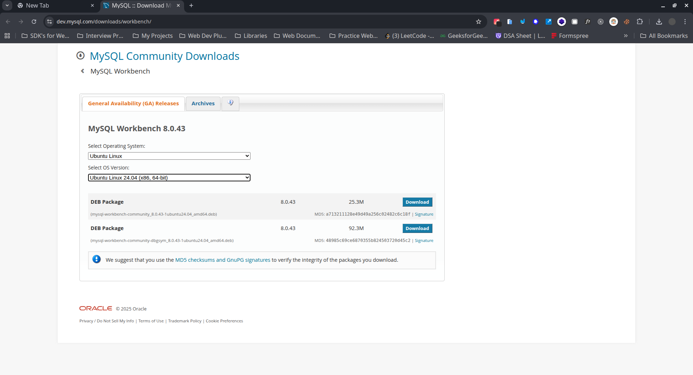

# How to install MySQL for Ubuntu?

- **Step1:-** Open Terminal. & check for update by writing this command.

```
sudo apt update
sudo apt upgrade
```

- **Step2:-** Install MySQL Server by writing this command.

```
sudo apt install mysql-server
```

- **Step3:-** Secure MySQL Server by writing this command.

```
sudo mysql_secure_installation
```

**It will ask some questions.**

1. Validate password component: Do you want to enforce strong passwords for your MySQL server? Choose a password strength level (Low, Medium, or Strong).

2. New password for root: Enter a strong password for the root user.

3. Remove anonymous users?: Do you want to remove anonymous users from the MySQL server?

4. Disallow root login remotely?: Do you want to restrict root login to only local connections?

5. Remove test database and access to it?: Do you want to remove the test database and access to it?

6. Reload privilege tables now?: Do you want to reload the privilege tables with the new settings?

In all the above question press y/Y.

- **Step4:-** Check that MySQL is running or not by writing this command.

```
sudo systemctl status mysql
```

- Step5:- Install Workbench from the given link.

[Install Workbench](https://dev.mysql.com/downloads/workbench/)

When you go to this link & select OS Ubuntu Linux or OS Version Ubuntu Linux 24.04 (x86, 64-bit). Than it will give us two options like the below image.



In this:-
1. `mysql-workbench-community_..._amd64.deb (25.3MB)`

This is the main software package for MySQL Workbench. It allows users to connect to databases, execute queries, design databases, and perform many other tasks. All users can install this package and use it to troubleshoot issues.

2. `mysql-workbench-community-dbgsym_..._amd64.deb (92.3MB)`

This package is essential for software developers who use MySQL Workbench, as it provides debugging symbols that help identify the source of application crashes. When an application crashes, these symbols enable developers to understand the cause of the error and provide assistance in resolving the issue. While normal users may not require this package, it is crucial for developers who need to troubleshoot crashes in MySQL Workbench.

- **Step6:-** Open MySQL Workbench or use the command line interface (CLI) to connect to the MySQL server.

Or Use the command `mysql -u root -p` to login using the root account and enter the password you set during installation.

---

**Note:-** You can use the MySQL Workbench to create, modify, and delete databases, tables, and rows, and to execute SQL queries.

**You can also use the MySQL CLI to create, modify, and delete databases, tables, and rows, and to execute SQL queries.**

---

# How to install MySQL for Windows?

For this check pdf which is accessed by the below link.

[PDF](./MYSQL_Notes.pdf)

---
